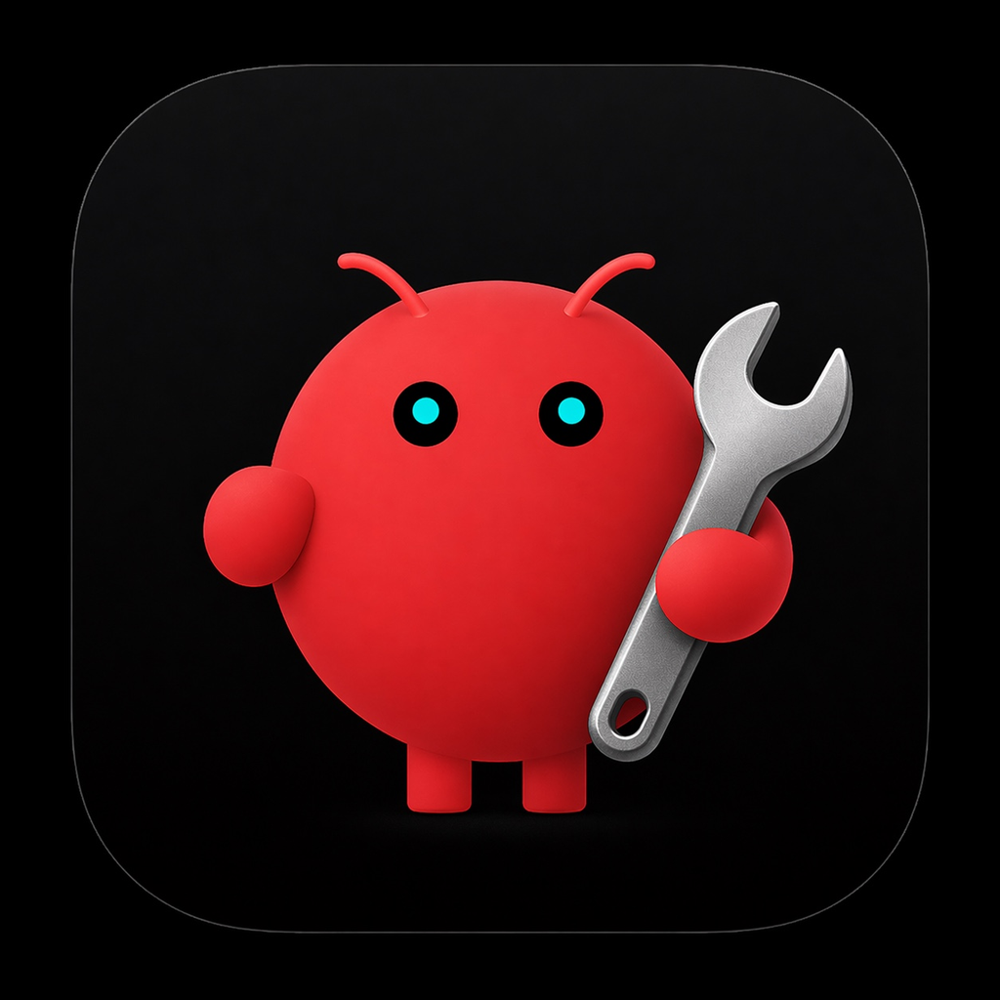
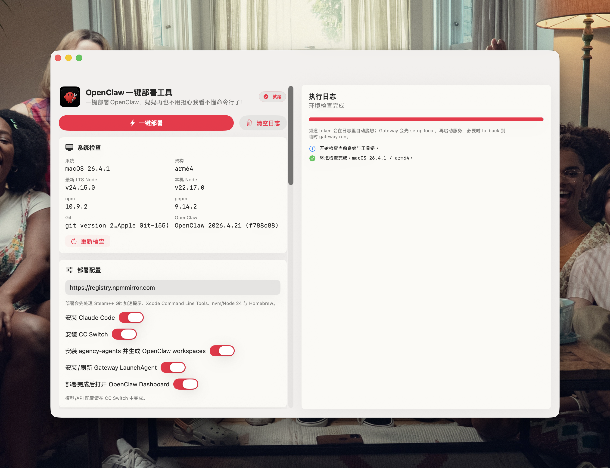

<div align="center">




# OpenClaw Deployer

### 一个原生 MacOS 一键部署工具，专为非技术人员打造，妈妈再也不用担心我看不懂命令行啦！

鸣谢：https://github.com/hotjp

</div>

---

## 运行截图



## 项目目标

- 一键检查并安装 OpenClaw 所需工具链（Node、npm、pnpm、Git 等）。
- 检测到本机已安装或残留 OpenClaw 环境时，可直接重新安装或卸载。
- 支持国内镜像场景（nvm Gitee 源、Node 镜像、npm 镜像）。
- 支持在部署配置中填写 OpenAI / Qwen Cloud API Key，并自动完成 OpenClaw 模型配置。
- 支持频道 token 保存与自动配置。
- 支持可选安装 Claude Code、agency-agents。
- 支持打包 `.app` 与 `.dmg`，方便分发给非开发同学。

## 部署工作流程

应用会先检查本机环境；若检测到 OpenClaw 已安装，主按钮会切换为“重新安装”，并额外显示“卸载”按钮。

点击“一键部署”或“重新安装”后，按顺序执行以下流程：

1. 系统预检：检测 macOS、架构、Node、npm、pnpm、Git、OpenClaw。
2. Git 连接加速提示：提示可使用 Steam++（Watt Toolkit）提升 GitHub 连接速度。
3. Xcode Command Line Tools/Git：缺失时执行 `xcode-select --install`。
4. nvm/Node 24：缺失时安装，已安装则跳过。
5. zsh 全局环境变量：将 `NVM_SOURCE`、`NVM_NODEJS_ORG_MIRROR`、`NVM_DIR`、`nvm.sh`、`bash_completion` 写入 `~/.zshrc`，并执行 `source ~/.zshrc` 校验。
6. Node/npm 验证：执行 `which node`、`which npm`、`node -v`、`npm -v`，确认全局环境已生效。
7. 可选安装项：Claude Code（默认开启，可在界面关闭）。
8. OpenClaw：缺失时安装，已安装则跳过。
9. OpenClaw 本地初始化：`setup`、workspace、gateway 默认配置。
10. OpenClaw 模型/API 配置：若检测到本机已存在 API Key 配置，会先提示用户选择“覆盖配置”或“跳过沿用”；若无现有配置则直接按当前部署参数写入 `openclaw.json`、`models.json`、`auth-profiles.json` 并执行配置校验；`Qwen Cloud` 默认只保留 `qwen/qwen3.6-plus`。
11. pnpm：缺失时安装，已安装则跳过。
12. 频道密钥与账号配置：自动保存 token 并尝试频道参数 fallback。
13. agency-agents：按开关执行，已存在目录时跳过避免覆盖。
14. Gateway 启动校验：必要时 fallback 到 `gateway run`；若本次更新了模型/API 配置、选择沿用现有 API Key 配置，或安装了 `agency-agents`，会按 `openclaw gateway stop`、`pkill -f openclaw`、清理 `18789` 端口、`openclaw gateway start`、`openclaw gateway status`、`openclaw dashboard` 的顺序重启并打开 GUI。

说明：

- 常规部署时，所有安装项都会先检查本机状态，已安装默认跳过，避免重复安装或覆盖。
- 重新安装模式会刷新 `OpenClaw`，以及当前勾选的 `Claude Code` / `pnpm` 组件；同时重新执行 local setup、模型配置、频道配置与 Gateway 校验。
- 卸载模式会停止 Gateway，调用 `openclaw uninstall` 清理 service/state/workspace，并继续检测卸载 `openclaw`、`pnpm`、`Claude Code` 全局 npm 包，清理 `~/.openclaw`、`LaunchAgents` 残留、部署器写入的 `~/.zshrc` 项，以及仅在安全时移除 `~/.nvm` / Node 24。

## 从 GitHub 下载并首次打开

1. 在 GitHub Release 页面下载 `OpenClaw-Deployer.dmg`。
2. 拖动 `OpenClaw Deployer.app` 到 `Applications`。
3. 首次打开若被系统拦截，可执行以下命令进行本机放行（常被称为“开发者签名放行”）：

```bash
xattr -dr com.apple.quarantine "/path/to/OpenClaw Deployer.app"
open "/path/to/OpenClaw Deployer.app"
```

## 构建与打包

### 本地构建 App

```bash
chmod +x Scripts/build_app.sh Scripts/package_dmg.sh Scripts/preview_macos.sh
./Scripts/build_app.sh
open "dist/OpenClaw Deployer.app"
```

### 打包 DMG

```bash
./Scripts/package_dmg.sh
open "dist/OpenClaw-Deployer.dmg"
```

### 调试运行

```bash
swift run OpenClawDeployer
```

### UI 预览（macOS 26）

```bash
./Scripts/preview_macos.sh
```

## Skill来源

- https://gitee.com/boomer001/agency-agents.git

## 备注

- 当前版本未启用 App Sandbox，适合 DMG 或内部签名分发。
- 模型/API 配置现已支持在部署器内填写并自动写入 OpenClaw 本地配置。
